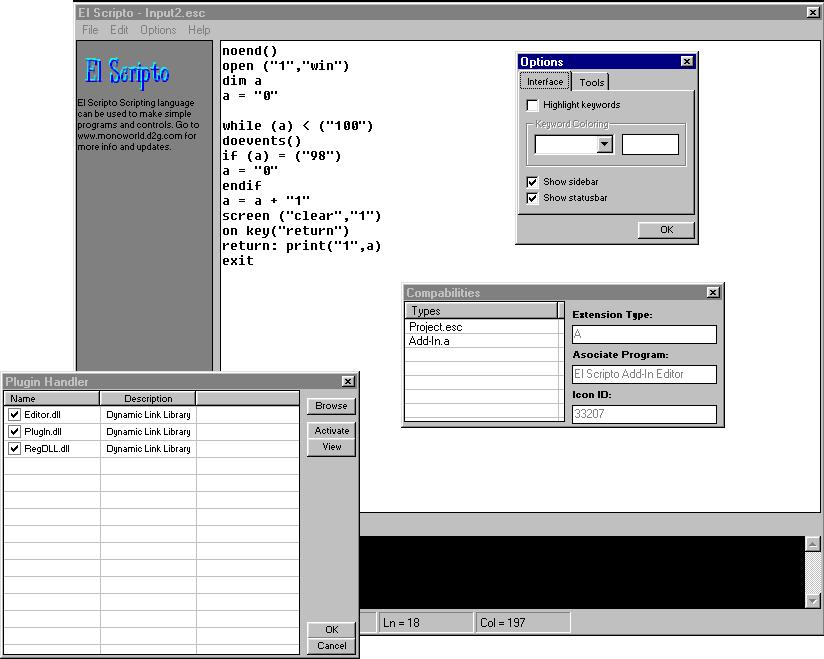



## El Scripto

### Description

This is another tweak of the somewhat popular scripting language JEL here on PSC =) I don't take any credit for the scripting class, but all of the other i've made myself! :) (I might add that it's not finished yet! There's alot more to do) Also, i've added some small network and keyboard input features and there's more to come.
 
### More Info
 
Don't make .exe files right now.. they don't end up to good; you can run them, but they restart when they should end.

             |
---                |---
**Submitted On**   |2002-04-27 23:55:16
**By**             |[ReXz](https://github.com/Planet-Source-Code/PSCIndex/blob/master/ByAuthor/rexz.md)
**Level**          |Intermediate
**User Rating**    |5.0 (10 globes from 2 users)
**Compatibility**  |VB 6\.0
**Category**       |[Miscellaneous](https://github.com/Planet-Source-Code/PSCIndex/blob/master/ByCategory/miscellaneous__1-1.md)
**World**          |[Visual Basic](https://github.com/Planet-Source-Code/PSCIndex/blob/master/ByWorld/visual-basic.md)
**Archive File**   |[El\_Scripto766934282002\.zip](https://github.com/Planet-Source-Code/rexz-el-scripto__1-34178/archive/master.zip)

